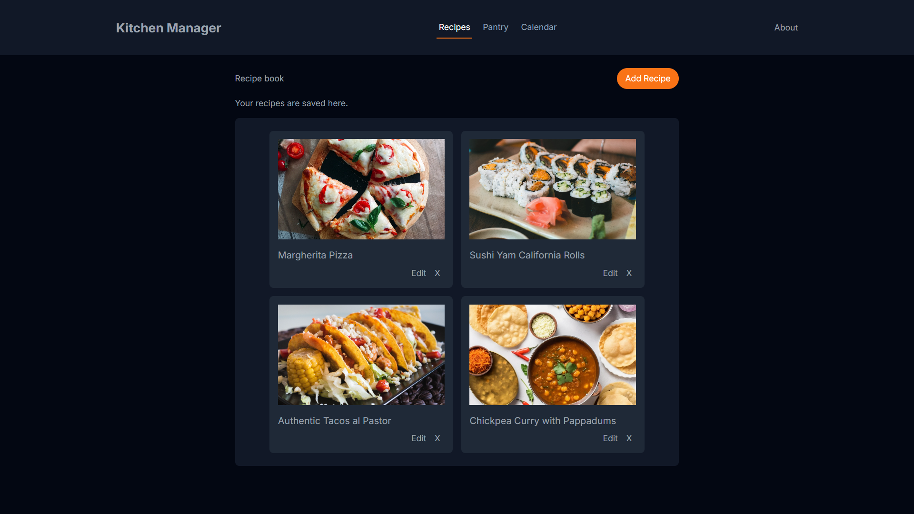

#  Kitchen Manager

Personal cooking manager — recipe book, pantry inventory and weekly meal planner.

**[Live Demo →](https://ghostknight17.github.io/kitchen-manager/)**

---
## Features

**Recipes**
- Add recipes with name, ingredients and instructions
- Browse your recipes as cards, edit them with ease or expand them to see full details
- Smart stock check: each recipe shows whether you have enough ingredients in the pantry

**Pantry**
- Manage your inventory by adding new ingredients or updating existing ones
- Use your preferred method to manage the quantity of each ingredient

**Calendar**
- Weekly meal planner view with a card for each day
- Assign any saved recipe to any day of the week

All data is persisted locally via `localStorage` - no account or backend required.

---

## Stack

- **React** + **TypeScript**
- **Vite**
- **Tailwind CSS**

---

## Author

**Lucas Sassali Algarbe**
- [GitHub](https://github.com/ghostknight17)
- [LinkedIn](https://www.linkedin.com/in/lucas-sassali)
